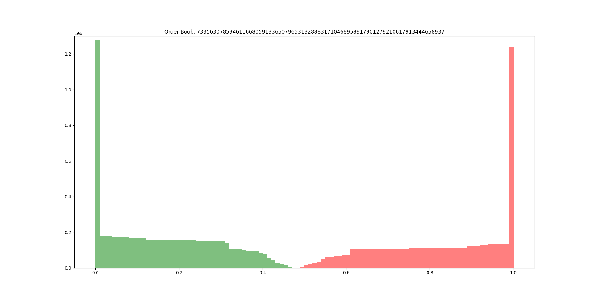

# User Guide
>work in progress

## Introduction
`polypy` is a wrapper around Polymarket's REST and websocket interface.
`polypy`'s implementation is biased and opinionated, and aims at delivering at least some level of comfort for interacting 
with Polymarket's interfaces, e.g., keeping track of orders and positions locally, maintaining a local oder book, etc.
Therefore, `polypy` offers custom (and to some extent customizable) implementations beyond Polymarket's very basic 
interfaces, though the very implementation might be considered opinionated towards an OOP design architecture (a more
functional package interface might be extended in the future).

### Installation
At the moment, `Polpy` has to be installed manually:
````
>> git clone https://github.com/hbr-l/polypy.git
>> cd polypy
>> pip install .
````
Instead of `pip install .`, you can also use:
````
>> pip install .[examples]  (includes dependencies for examples)
or
>> pip install -e .[dev]    (editable with development dependencies e.g., for testing)
````
Note, that depending on your terminal/shell, you might need to run `pip install '.[examples]'` (quotation marks) instead.

### Allowances and Authentication
1) In order to be able to trade on Polymarket, the correct token allowances must be set before orders can be placed via the API.
2) Certain functions and methods need an authentication via the account's api key, private key (for signing, will not 
actually be sent in any payload), secret, passphrase and wallet address (__NEVER SHARE OR PUBLISH YOUR PRIVATE KEY__).
  
_`polypy` does neither support setting allowances, nor creating API keys, as this is outside the scope of this package._
  
Please refer to [py-clob-client](https://github.com/Polymarket/py-clob-client/tree/main), the official 
[Polymarket documentation ](https://docs.polymarket.com/#introduction) or Polymarket's Discord for allowances and authentication.  
If you are using Mail/Magic-Login, please refer to [Magic-Login](#magic-login), which simplifies allowances and authentication
quite a lot (i.e., actually not necessary when using Magic-Login).

#### Magic-Login
If you use Mail/Magic-Login (btw. __NEVER TYPE IN A NUMBER CODE INTO MAGIC'S LOGIN PAD THAT YOU HAVEN'T ACTIVELY 
REQUESTED YOURSELF__), you can obtain the necessary credentials by:
1) Open DevTools of your browser and search for a websocket named "user". The first websocket message sent, contains
your api key, secret and passphrase
2) Your wallet address (usually used in `polypy` for `maker_funder`/`maker` argument) is displayed on Polymarket's website 
beneath your profile image (starts with "0x...."). Be aware, that is not the same address as the address where you deposit to!
3) Your private key (__NEVER SHARE YOUR PRIVATE KEY__) can be obtained via Polymarket's website: Go to your profile,
click "Edit profile" and then "Export Private Key".

### Floating Point Imprecision, Rounding and Decimal Type
In general, not all real numbers can be represented by floating point numbers. This stems from storing number in a 
binary number system and is independent of the programming language used:
````python
0.1 * 3
>> 0.30000000000000004  # instead of 0.3
````
These small errors might accumulate over the course of multiple arithmetic operations and might lead to unexpected 
results - especially when handling currencies and monetary units.  
  
As already stated, this really is independent of the very programming language in use.
`polypy` tries to minimize errors due to floating point imprecision by implementing dedicated rounding approaches in the 
`polypy.rounding` module (e.g., `polypy.rounding.round_half_even`), but actually calling these explicitly is usually not 
necessary.
Nonetheless, error might accumulate, and it is recommended to use Python's `decimal.Decimal` type instead (which is also faster, 
because of dedicated rounding methods for Decimal types).
  
For Decimal types as well as zeros array (analogously to `np.zeros`):
````python
import polypy as plp

x = plp.dec(0.1)
>> Decimal("0.1")

zeros = plp.zeros_dec(3)
>> np.array([Decimal("0"), Decimal("0"), Decimal("0")], dtype=object)
````

### Rate Limits, Trading Limits and Subscription Limits
_Note: the following limits are imposed by Polymarket and are independent of `polypy`s implementation._  
  
As of the time of writing this documentation, following limits apply:
1) __Rate limits__ for interacting with Polymarket REST:
   - `polypy.ENDPOINT.REST`: 125 requests/10 seconds
   - `polypy.ENDPOINT.DATA`: 100 requests/10 seconds
2) __Trading limits__ for trading on Polymarket:
   - min. limit order size: 5 shares
   - min. market order amount: 1 USDC
   - 10 orders/second - 100 burst
   - 2 orders/second per book (4/s by market) - 20 burst
   - 1 second minimal interval between order submission and cancellation
3) __Subscription limits__ for websockets:
   - `polypy.ENDPOINT.WS`: max. 500 subscriptions (e.g., market or asset IDs)

> Above limits might or might not be outdated. Users are advised to confirm limits beforehand. Unfortunately, there is
> no official documentation, but only Discord conversations regarding rate limits - take it with a grain of salt!

## Central Limit Order Book (CLOB)
### What is a CLOB?
Polymarket provides a L2 (central) limit order book (aka. 'CLOB').
A L2 limit order book shows the aggregated/summed volume of all resting limit orders at each price level.
  
Given the nature of prediction markets, each market (aka. bet) consists of either Yes or No shares. Each of these shares 
is implemented as a separate token, s.t. each market consists of two (or in case of multiple outcomes, multiple) tokens.
  
Each token has its own limit order book, though they are directly coupled via a complementary relationship:
Buying 1 Yes share is equivalent to selling 1 No share, and vice versa.  
Therefore, the bid of a Yes share (buy order) is directly related to the ask of a No share (sell order):
$$p_{bid}^{yes} = 1 - p_{ask}^{no}$$
and quantities:
$$q_{bid}^{yes} = q_{ask}^{no}$$
  
Because of this complement, both tokens in essence point to the same unified limit order book.  
By this, it is sufficient to only track the order book for one token, as the complement can easily be computed with above 
formulas.  
Also note, that best bid and best ask do not necessarily need to sum up to 1 (can be greater or less), as prices are 
solely set by market participants and their resting limit orders in the CLOB.  
For further reading about how the unified complementary CLOB works, please refer to: [An In-Depth Overview of Polymarket's Market Making Rewards Program](https://mirror.xyz/polymarket.eth/TOHA3ir5R76bO1vjTrKQclS9k8Dygma53OIzHztJSjk)

### Tick sizes
In general, each share price can only take on values in the interval `(0, 1)`.  
If a bet is won, the shareholder will be paid back 1 USDC, and if the bet is lost, the initial principal is lost to the 
counterparty.

Furthermore, share prices can only take on discrete levels, which are a multiple of the so called 'tick size' (just as stock
prices), e.g. '0.50', '0.51', '0.52', ... for a tick size of 0.01 USDC - meaning share prices can only move/jump by the 'tick size'.
Markets usually start at a tick size of 0.01 USDC (1 cent), but might change to 0.001 USDC if $p > 0.96$ (above) or $0.04 > p$ (below). 
Prices must conform to $ticksize < p <= 1 - ticksize$.

You can get the tick size by:
````python
import polypy as plp

token_id = "..."    # ID of token
tick_size = plp.get_tick_size(plp.ENDPOINT.REST, token_id)
````
or as we see later on:

````python
import time
import polypy as plp

token_id = "..."  # needs to be specified by user
tick_size = plp.get_tick_size(plp.ENDPOINT.REST, token_id)
# or set manually if you're certain where the current price is: 
# tick_size = 0.01 or tick_size = 0.001

book = plp.OrderBook(token_id, tick_size)
stream = plp.MarketStream(plp.ENDPOINT.WS, book, None, plp.ENDPOINT.REST)
stream.start()

while True:
   tick_size = book.tick_size   # up-to-date tick size
   ...
````
The `stream` listens to a websocket and continuously updates the order book, including the tick size 
(note: no stream = no live updates = no up-to-date tick size). See later paragraphs for more explanations.

### CLOB in `polypy`: `polypy.OrderBook`
````python
import polypy as plp

token_id = "..."    # needs to be specified by user
tick_size = 0.01

book = plp.OrderBook(token_id, tick_size)
````

The `OrderBook` class stores price and quantities (=size) for bids and asks at each level, as well as the tick size:
````python
# book keeps track of (excerpt):
best_ask_p = book.best_ask_price    # numeric value
best_ask_q = book.best_ask_size     # numeric value
mid = book.midpoint_price       # numeric value
tick_size = book.tick_size      # numeric value
````

- Asks are sorted in ascending order: best ask (lowest) at index 0.  
- Bids are sorted in descending order: best bid (highes) at index 0.  

Thereby, if you want to plot an order book depth chart, then you can easily and directly use `np.cumsum` without the 
need to re-sort any arrays.
See [examples/order_book_streaming.py](../examples/order_book_streaming.py):    


#### Marketable Price
The `OrderBook` can also be used to calculate the marketable price, which is the price at which an order would be fill 
in its entirety (immediate fill by crossing the spread):
````python
import polypy as plp

book = plp.OrderBook(...)
market_price = book.marketable_price(plp.SIDE.BUY, 100)
````
Above example calculate the price at which a buy (marketable/aggressive limit) order of 100 USDC volume would fill immediately.
If no marketable price can be calculated, e.g., the amount exceeds the liquidity in the book, an `OrderBookException` will be raised. 
  
#### Numeric Type: Float vs. Decimal
The numeric type (cf. [Floating Point Imprecision](#floating-point-imprecision-rounding-and-decimal-type)) of the `OrderBook` 
can be controlled via the `zeros_factory` argument in `__init__`.  
By default, this is a zeros-array of type np.float64, though it is recommended to use the Decimal type via `plp.zeros_dec` 
as argument for `zeros_factory`:
````python
import polypy as plp

book = plp.OrderBook("[token_id]", plp.dec(0.01), zeros_factory=plp.zeros_dec)
book.dtype
>> Decimal
````

#### Manipulating the OrderBook
Whilst `OrderBook` exposes some methods to manipulate the order book directly (e.g., writing bids and asks into), usually 
there is absolutely no need to do so manually.
````python
# methods to manipulate book manually (excerpt):
book.set_asks(list_ask_prices, list_ask_sizes)
book.update_tick_size()
````
Instead, the `OrderBook` should rather be assigned to a [MarketStream](#market-stream), which updates the order book 
in real time within a separate thread, s.t. the user does not have to care for updating or manipulating the order book manually.
The `OrderBook` is designed s.t. only its properties and attributes should be accessed but not set (unless for a good reason).
  
#### Manually Updating the OrderBook
If you do not want to assign the order book to a `MarketStream`, then you still can update manually via:
````python
import polypy as plp

book = plp.OrderBook(...)

book.sync(plp.ENDPOINT.REST)    # update bids and asks
book.update_tick_size(plp.ENDPOINT.REST)    # update tick size
````

#### Advanced: Order Book Hash, Multiprocessing
The current state of the order book (bids and asks) can be captured via hashing:
````python
import polypy as plp

book = plp.OrderBook(...)

market_id = "..."   # market ID to which the token belongs to
timestamp = ...     # int: time of order book generation in millis
book.hash(market_id, timestamp)
````
The timestamp denotes the time of order book generation, which is when the order book last changed.
The hash can be used, to prove the conformity of a locally maintained order book (or can be used as e.g., a key for a dict).
Usually, the user does not need to care about the hash as `polypy` will check hash conformity with incoming websocket 
messages automatically.
  
The default implementation is not suitable for multiprocessing. If multiprocessing is necessary, the `zeros_factory` must 
return an array of zeros which is capable of being used within multiprocessing - typically one would choose a shared memory 
implementation for this purpose (_multiprocessing.SharedMemory_). Furthermore, the zeros array returned by `zeros_factory` 
must implement adequate locking/mutex as `OrderBook` does not use any (and does not need) any sophisticated locking.


## Orders
### Order Types
### Creating Orders
### Order Manager

## Positions
### Position Types
### Creating Positions
### Position Manager

## Trades
_tbd_

## Streams
### Market Stream
### User Stream

## REST API functions